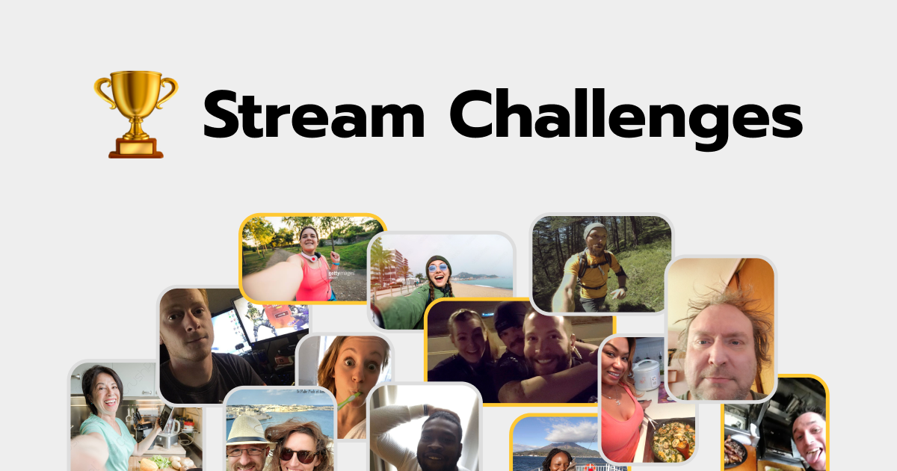

## ✨ About

Today, it's hard for a beginner blogger to stand out and get an audience. To solve this problem, I propose a new approach to streaming!

Stream Challenges is an application where people have to stream every day at a random time.

## ⚡How it works

### BNB Smart Chain (BSC)

1. Connect wallet, create a profile on your account page and enable notifications.
2. Get a notification at a random time and start a video stream.
3. Interact with the audience and finish the stream by uploading the recording.
4. Earn points for each finished stream to get on the leaderboard and reach a bigger audience.

### Crossbell

1. Connect wallet and follow the project account on Crossbell to be notified about challenge started.
2. Get a notification at a random time and start a video stream.
3. Interact with the audience and finish the stream by uploading the recording.
4. Earn points for each finished stream to get on the and reach a bigger audience.

## 🔗 Links

- [Application](https://stream-challenges-app.vercel.app/)

## ⚒️ Technologies

- Huddle01
- FVM
- Lighthouse
- Solidity
- TypeScript
- Hardhat
- React
- Next.js
- wagmi
